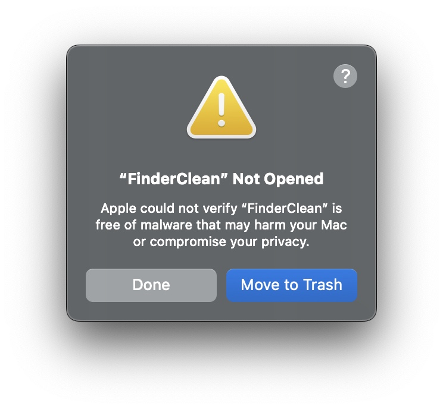
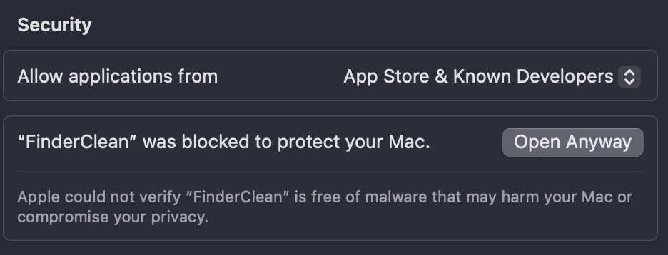
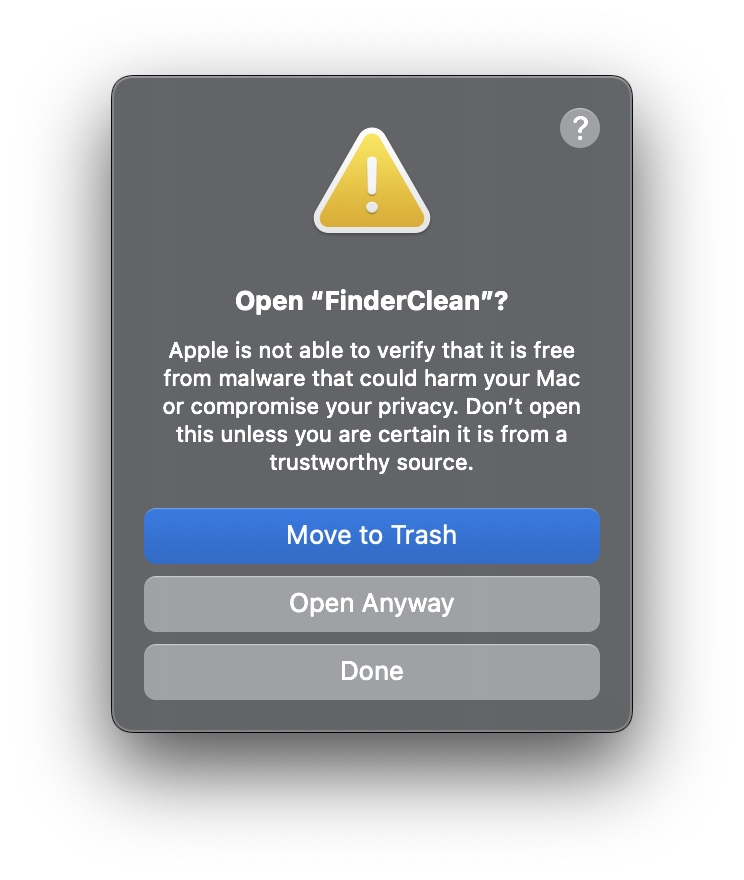

# Finder Cleaner - Finder Junk Cleaner Tool


## Introduction
Finder Cleaner can locate and delete all junk files generated by macOS Finder or Windows File Explorer in the current path and all its subpaths. 

The currently supported file types for deletion are as follows:
- `.DS_Store`
- `._AppleDouble`
- `.apdisk`
- `.fseventsd`
- `.Spotlight-V100`
- `.TemporaryItems`
- `.Trashes`
- `.VolumeIcon.icns`
- `Desktop.ini (Windows)`
- `$RECYCLE.BIN (Windows)`
- `Thumbs.db (Windows)`
- `System Volume Information (Windows)`

## Usage
### Set the Executable Permission for Finder Cleaner
If Finder Cleaner is NOT automatically recognized as Unix Executable File, run the following command in Terminal o set Finder Cleaner as an executable file:
```bash
% chmod +x <Finder Cleaner's path>
```

You can directly drag the Finder Cleaner file from Finder into the terminal window, and the path will be filled in automatically.   

For example:
```bash
% chmod +x /Users/username/Downloads/FinderCleaner
```
### Bypass the Security Mechanism of macOS
Since the program is not signed, it is likely to trigger the security mechanism of macOS (Gatekeeper).    

You may occur the following Warning while openning the Finder Cleaner:
<div style="display: flex; justify-content: space-around;">
  
</div>

There are two solutions to fix this, as long as you don't click 'Move to Trash', but the other button.

#### Solution 1 (Temporary)
##### Step 1:
 Open System Settings --> Privacy & Security, you can see it mentioning “FinderClean“ at the Security section, click "Open Anyway"
<div style="display: flex; justify-content: space-around;">
  
</div>

##### Step 2: 
Click "Open Anyway" on the pop-up window.  
<div style="display: flex; justify-content: space-around;">
  
</div>

#### Solution 2（Permanent）
##### Step1:
Enter the following command in the terminal, and then enter the login password of the computer
```bash
sudo spctl --master-disable
```
##### Step 2: 
Open System Settings --> Privacy & Security, allow applications from "Anywhere". In macOS 15.0 or later, there might be another pop-up window after selecting "Anywhere", allow it anyway.
<div style="display: flex; justify-content: space-around;">
  
</div>


## Dependencies
This project requires the following dependencies:

- Python 3.8 or higher
- psutil >= 5.9.0
- PyInstaller* >= 6.11 (For packaging)
 
## Packaging
Finder Cleaner was packaged by pyinstaller. The Unix Executable File (Mach-O Format) is only available on macOS right now. However, it could be packaged on different platforms.   

The following commands are used for packaging on macOS and can be used as a reference:
```bash
 % pyinstaller --onefile --add-data "modules:modules" --collect-all psutil __main__.py
```

 ## Future Update Plan
 - Customize the types of cleanup files
 - Enable users to ignore specific sub-path
 